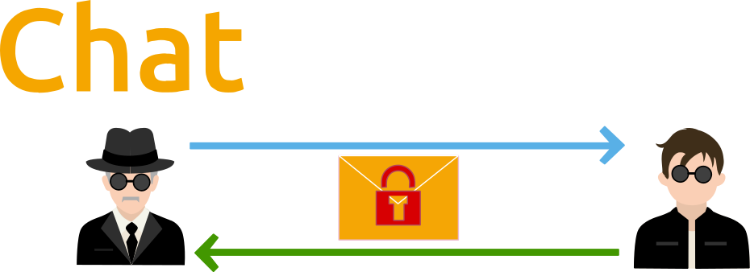

# 

##### xNPM logic is based on "Multisig unconfirmed transactions" with lifetime 12 seconds(optional).
##### This means that transaction will be delivered but **never be confirmed and recorded on blockchain**.

- Application **DOESN'T** store any information
- Application works without server-side
- After refreshing page, all history will be cleared **forever** 
- The cost of unconfirmed transaction is 0 xem.
- For initiating **unconfirmed transaction** you should have some xem.
- The more balance the more message could be send at the same time.  
- The cost of registration (creation multisig account) is 0.5 xem.
#### WEB: [https://f0a18484.github.io/npm/](https://f0a18484.github.io/npm/)
#### DOWNLOAD: [Releases](https://github.com/f0a18484/xnpm-source/releases)
#### SRC: [https://github.com/f0a18484/xnpm-source](https://github.com/f0a18484/xnpm-source)
### 1. Chat: All messages are encrypted.  

### 2. Live: All messages are unencrypted(public channel).  

### 3. Group: All members of group have private key of the group which one they use to decrypt message.

### 4. Network is more than 500 nodes

### Feedback:
  **NAUX575WMRIVOOFS64KN7YIERLQCYBGMXH2PXNPM**
## Powered by  
